# 📅 Appointly

[](https://react.dev/)
[](https://nodejs.org/)
[](https://www.mongodb.com/)
[](https://expressjs.com/)
[](https://tailwindcss.com/)
[](https://stripe.com/)

---

# 📅 About Appointly

**Appointly** is a full-stack **SaaS Appointment Booking Platform** built using the **MERN Stack (MongoDB, Express.js, React.js, Node.js).**

It helps businesses manage services, availability, bookings, customers, payments, and earnings through a centralized platform.

This project focuses on:

- Clean UI/UX
- Real appointment booking logic
- Secure authentication and OTP verification
- Stripe payment integration
- Google Calendar synchronization
- Provider and admin management

A strong portfolio-ready full-stack SaaS project.

---

# ✨ Features

## 📅 Provider Features (Client)

- Manage business profile
- Create and manage services
- Set availability
- Manage bookings
- Manage customers
- View earnings and payments
- Google Calendar synchronization
- Public booking link
- OTP email verification
- JWT authentication
- Fully responsive design

---

## 🛠 Admin Features

- Admin dashboard
- Manage providers
- View bookings
- Monitor payments
- Manage platform operations
- View business information

---

## 💳 Payment

- Stripe integration
- Secure online payment flow
- Payment verification
- Booking confirmation
- Platform fee calculation
- Provider payout calculation
- Payment status tracking

---

# 🛠️ Technologies Used

## Frontend (Client & Admin)

- React (Vite)
- Tailwind CSS
- Axios
- React Router DOM
- React Toastify
- Lucide React

---

## Backend (Server)

- Node.js
- Express.js
- MongoDB & Mongoose
- JWT Authentication
- Stripe Integration
- Google Calendar API
- Brevo Email Services
- REST APIs

# 📸 Screenshots

## 📅 Client (Provider Side)

### Dashboard

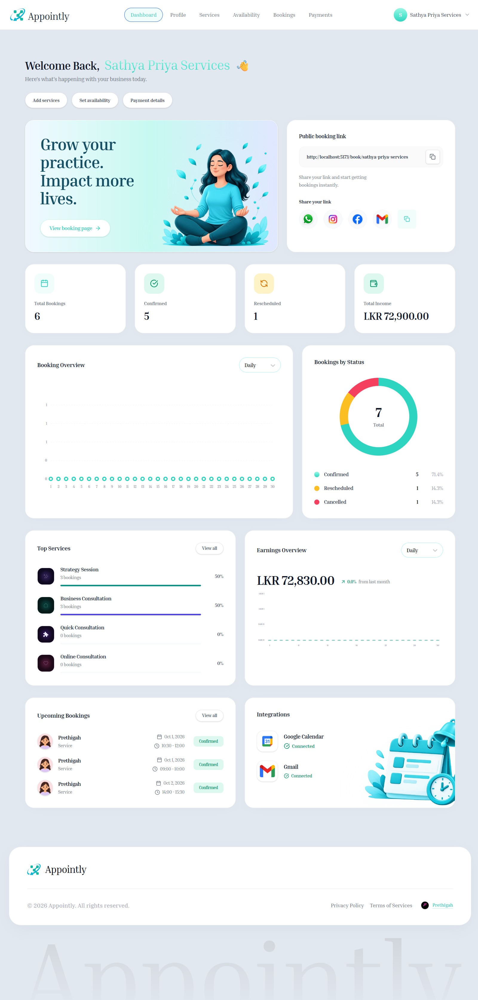

### Profile

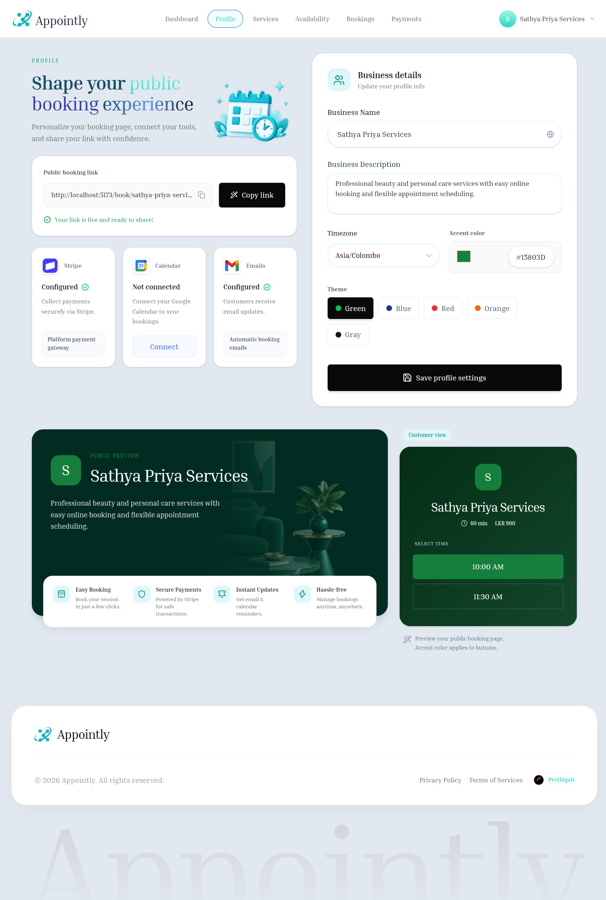

### Services

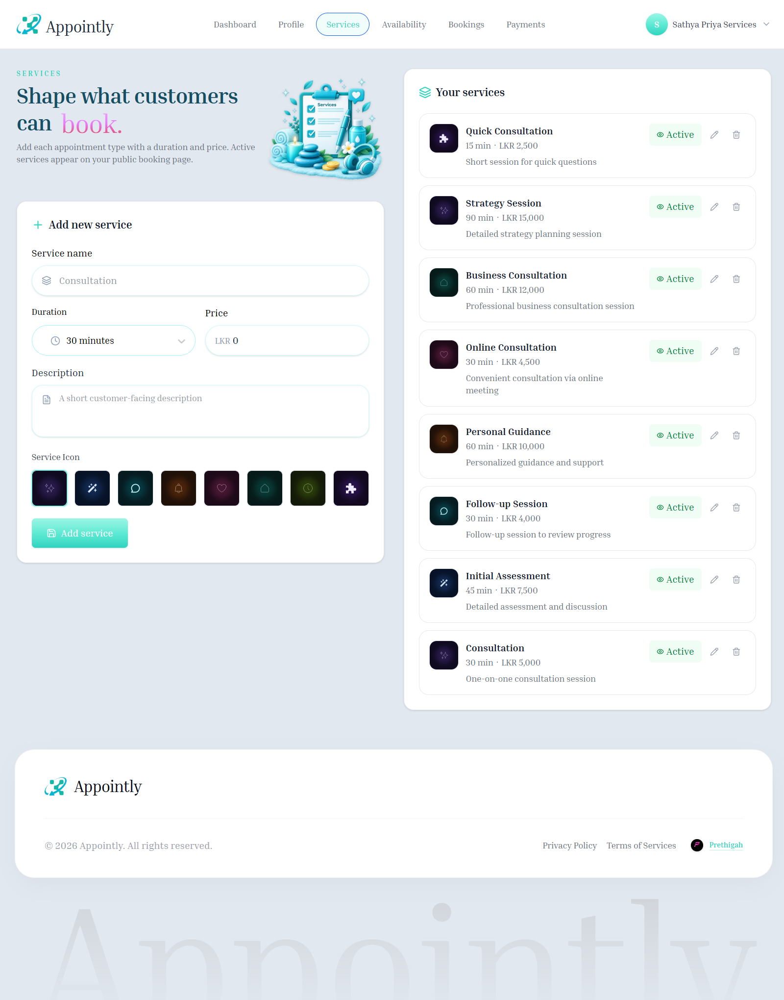

### Availability

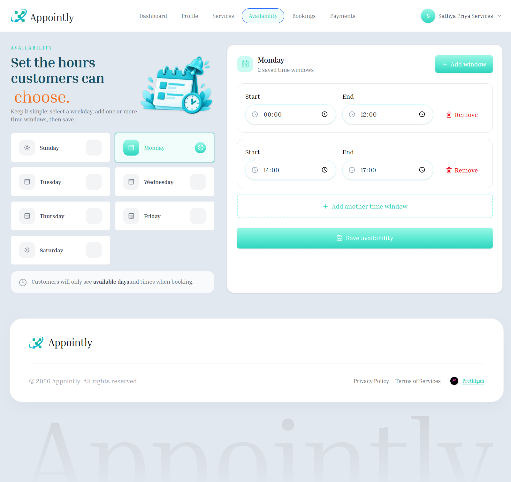

### Bookings

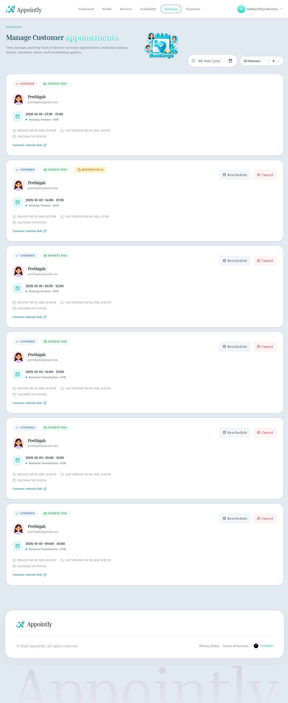

### Payments

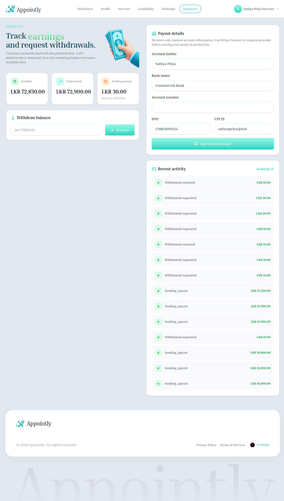

---

## 🌐 Public Booking

### Public Booking

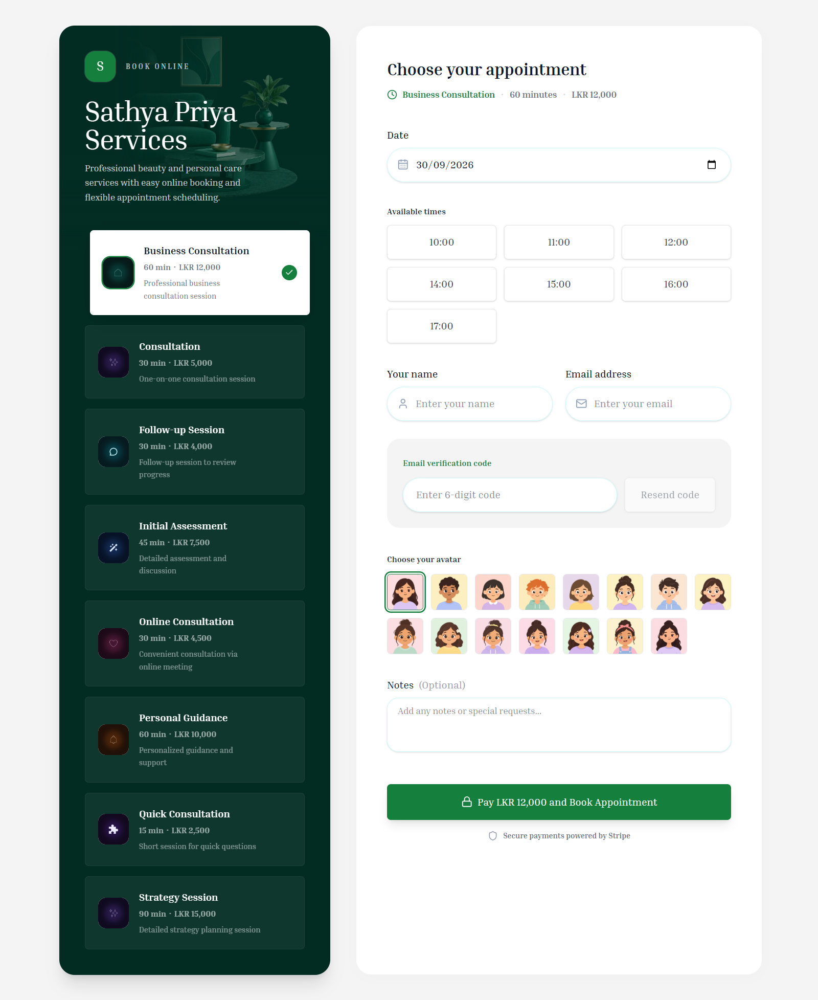

### Booking Success

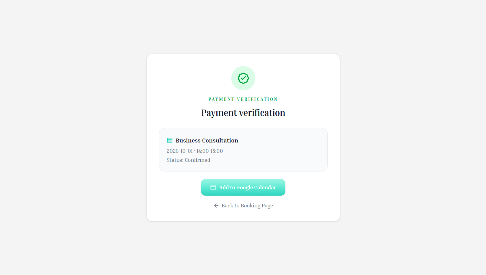

### Booking Cancel

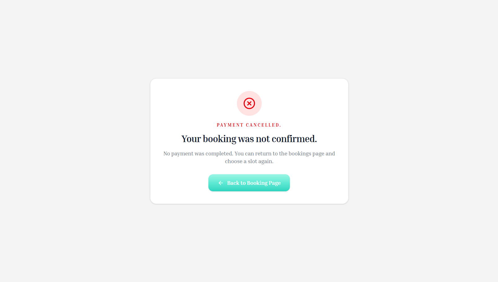

---

## 🛠 Admin Panel

### Admin Login

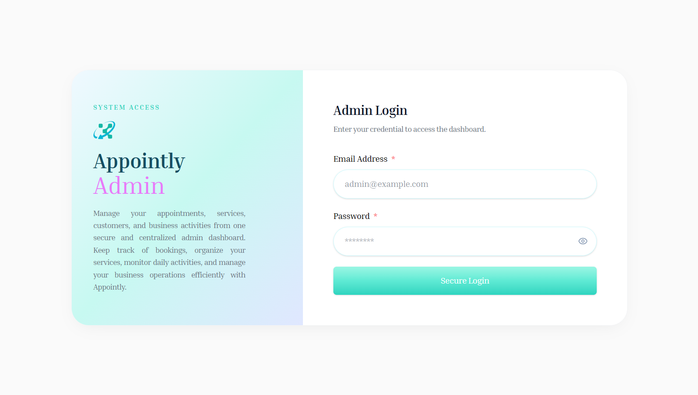

### Admin Dashboard

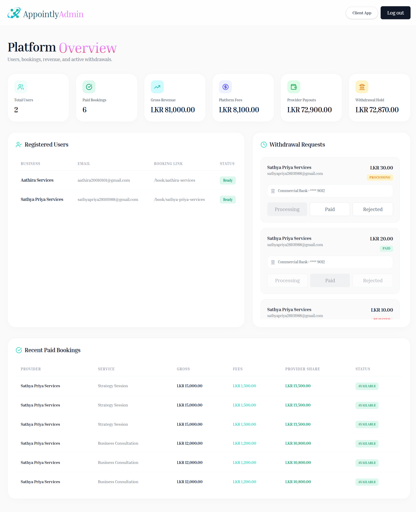

---

# ⚙️ How to Run the Project

## 1️⃣ Clone Repository

```bash
git clone https://github.com/PrethigahShanmugarajah/Appointly.git
cd Appointly
```

---

## 2️⃣ Backend Setup (Server)

```bash
cd Server
npm install
npm run server
```

---

## 3️⃣ Client Setup

```bash
cd Client
npm install
npm run dev
```

---

# 🔑 Environment Variables

## 📂 Server (.env)

```env
PORT=
MONGODB_URI=
PROJECT_NAME=
TIME_ZONE=
BREVO_SENDER_EMAIL=
BREVO_SENDER_NAME=
EMAIL_FROM=
BREVO_API_KEY=
BREVO_TRANSACTIONAL_EMAIL_URL=
CURRENCY_CODE=
LOCALE=
MAX_OTP_ATTEMPTS=
OTP_TTL_MINUTES=
JWT_SECRET=
JWT_SECRET_EXPIRES_IN=
STRIPE_SECRET_KEY=
CURRENCY=
GOOGLE_CLIENT_ID=
GOOGLE_CLIENT_SECRET=
GOOGLE_REDIRECT_URI=
GOOGLE_CALENDAR_URL=
GOOGLE_CALENDAR_SCOPE=
CLIENT_URL=
PLATFORM_FEE_RATE=
ADMIN_EMAIL=
ADMIN_PASSWORD=
STRIPE_PUBLISH_KEY=
SERVER_URL=
```

---

## 📂 Client (.env)

```env
VITE_CURRENCY=
VITE_LOCALE=
VITE_BACKEND_URL=
VITE_PORTFOLIO_NAME=
VITE_PORTFOLIO_URL=
VITE_WHATSAPP_URL=
VITE_INSTAGRAM_URL=
VITE_FACEBOOK_SHARE_URL=
VITE_TIME_ZONE=
VITE_TIME_ZONES=
VITE_SUPPORT_EMAIL=
VITE_GOOGLE_API_SERVICES_POLICY_URL=
VITE_PRIVACY_POLICY_LAST_UPDATED=
VITE_TERMS_OF_SERVICE_LAST_UPDATED=
VITE_GOVERNING_LAW_COUNTRY=
```

---

# 👨‍💻 Author

**Prethigah Shanmugarajah (2020/2021)** </br>
Department of Software Engineering </br>
Faculty of Computing </br>
Sabaragamuwa University of Sri Lanka </br>

---
